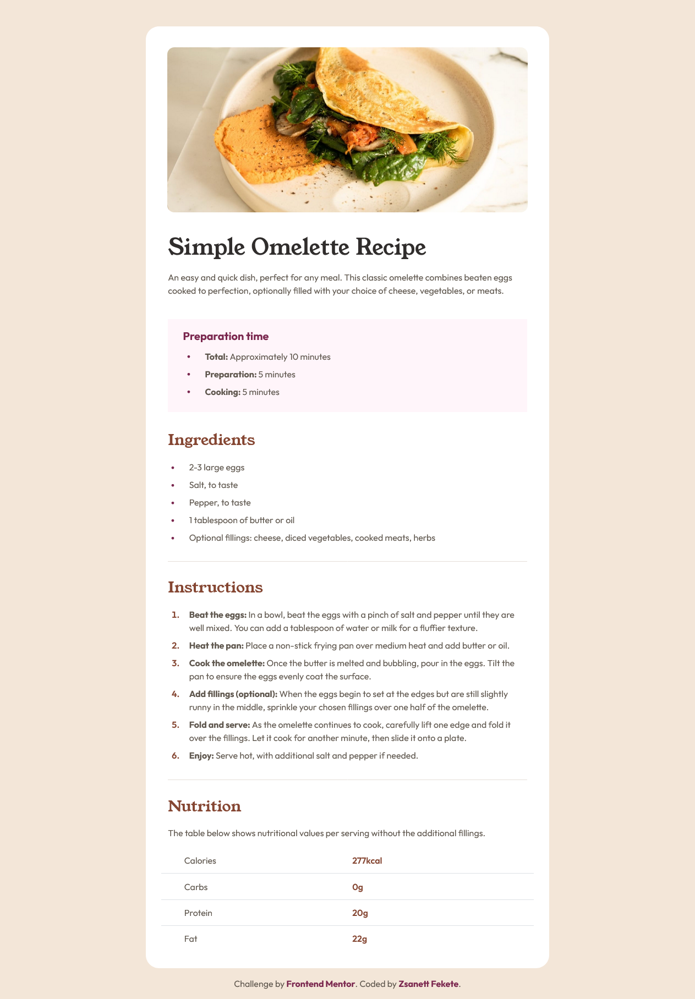
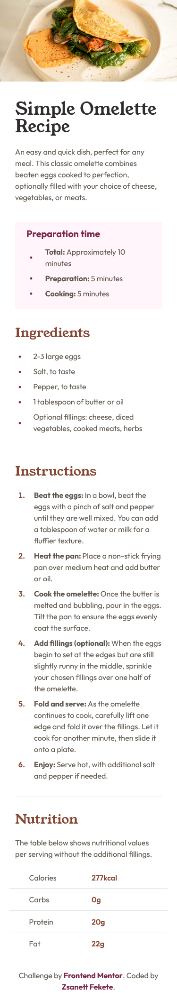

    

<h1 align="center">Recipe page</h1> 

    <h3>
        <a href="" target="_blank" title="Live Site">Live</a>
         | 
        <a href="" target="_blank" title="Solution">Solution</a>
         | 
        <a href="" target="_blank" title="Challenge">Challenge</a>
    </h3>

This is a solution to the <a href="https://www.frontendmentor.io/challenges/recipe-page-KiTsR8QQKm" target="_blank" title="Recipe page challenge">Recipe page challenge on Frontend Mentor</a>. Frontend Mentor challenges help you improve your coding skills by building realistic projects.

## The Challenge

Your challenge is to build out this recipe page and get it looking as close to the design as possible.

You can use any tools you like to help you complete the challenge. So if you've got something you'd like to practice, feel free to give it a go.

## Built With

### Technologies and Tools Used in This Project

    
    
    
    
    
    

### Features

- **Responsive Design**  
  
The layout adapts to different screen sizes, ensuring that the component looks great on both mobile devices and larger screens.

- **Mobile-first workflow**  
  
The design and development process prioritized mobile users, ensuring a seamless experience on smaller devices before enhancing it for larger screens.

- **Semantic HTML5 Markup**  
  
Used semantic HTML elements to improve accessibility and SEO.

- **Flexbox Layout**  
  
Implemented flexible and responsive layouts using CSS Flexbox, allowing for easy alignment and distribution of elements.

- **Webpack Configuration**  
  
Configured Webpack for bundling JavaScript, CSS, and other assets, optimizing the build process and improving performance.

## Useful Resources

- **[PerfectPixel](https://chrome.google.com/webstore/detail/perfectpixel-by-welldoneco/dncdmhaachlacdlpebniopbgkecglnha)**  
  
PerfectPixel is a Chrome extension used by web developers and designers to compare the actual appearance of a webpage with its design. This tool is particularly useful for achieving pixel-perfect development, ensuring that the implemented design matches the intended design accurately.

- **[ColorZilla](https://chrome.google.com/webstore/detail/colorzilla/bhlhnicpbhignbdhedgjhgdocnmhomnp)**  
  
ColorZilla is a popular Chrome extension used by web developers and designers for easy and quick color selection and analysis. With ColorZilla, you can effortlessly pick the color of any element on a webpage and it offers many other useful features for color management and analysis.

## Mobile Version

    

## Author

- **Website** - [zsanifekete.github.io](https://zsanifekete.github.io/)
- **Frontend Mentor** - [@zsanifekete](https://www.frontendmentor.io/profile/zsanifekete)